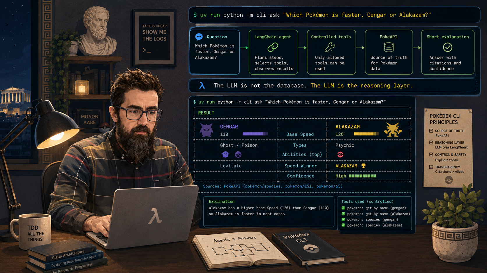
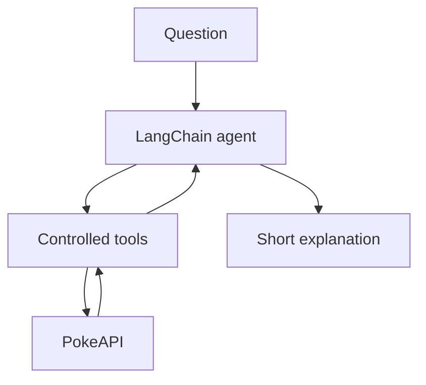
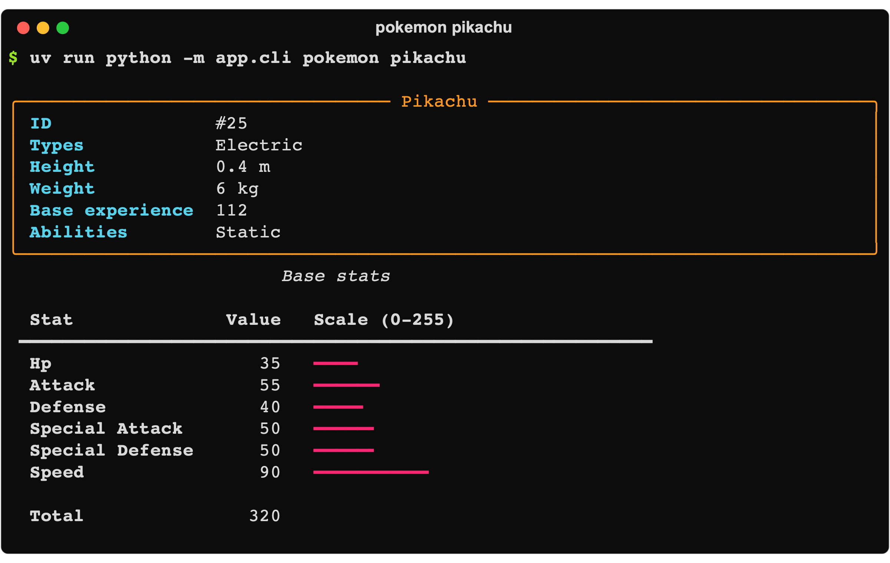
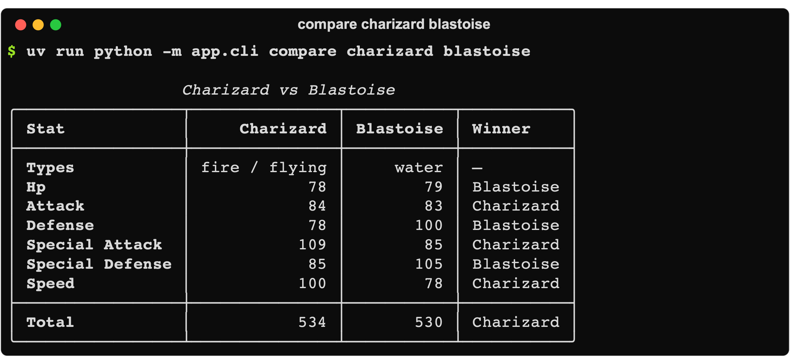
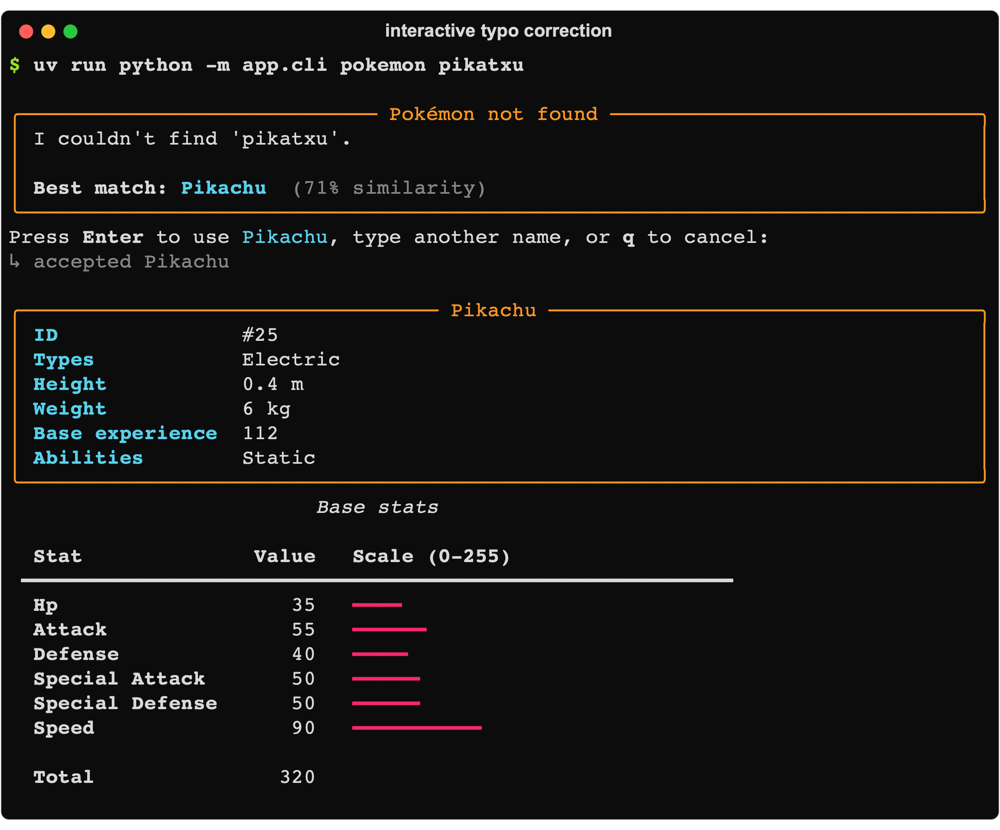
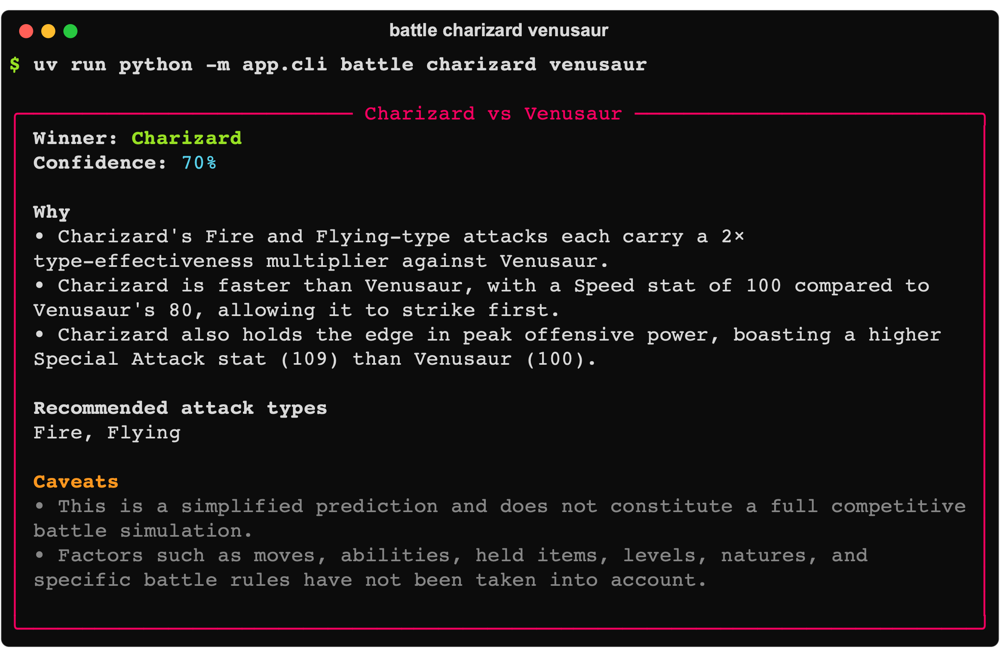

# A Pokédex in the terminal, but agentic

This project is a spin-off of a small that we started during
the Katayuno on June 20, 2024. Katayuno is a Saturday morning programming kata where the
conversation, debate and retrospective normally matter more than finishing the
exercise. That time, helped by AI, almost every team actually finished.

My version used React, TypeScript and Vite, with PokeAPI directly from the
browser [React Pokédex](https://github.com/gonzalo123/pokemon). It had the usual things: list, details, comparison, shiny sprites and
even a small battle mode.

But that application was deterministic. Click here, fetch this, render that.

This time I wanted something slightly different. I wanted a Pokémon professor
in my terminal. Not a chatbot that hallucinates Pokémon facts. A small agent
that uses [PokeAPI](https://pokeapi.co/) as the source of truth and an LLM only
as the reasoning layer.

> The LLM is not the database. The LLM is the reasoning layer.

I don't want the model to remember Pikachu's Speed. I want the model to ask the
tool.



## The idea

The project is a Python 3.13 CLI built with Click, Rich, httpx, Pydantic and
LangChain. AWS Bedrock is the default model provider, but it lives behind one
small factory, so changing the provider does not require changing the PokeAPI
code.

The flow is deliberately boring:



The agent cannot fetch arbitrary URLs. It only receives five tools:

- `get_pokemon`
- `get_type`
- `compare_pokemon`
- `get_evolution_chain`
- `get_type_matchup`

This is not magic. The tools are normal Python functions returning small,
normalized dictionaries. LangChain decides when to call them and the model
reasons with their output.

## The CLI

The deterministic commands work without AWS credentials:

```bash
uv run python -m cli pokemon pikachu
uv run python -m cli search charizrad
uv run python -m cli compare charizard blastoise
```

The commands involving reasoning can use Bedrock:

```bash
uv run python -m cli compare charizard blastoise --explain
uv run python -m cli battle charizard venusaur
uv run python -m cli ask "Which Pokémon is faster, Gengar or Alakazam?"
```

## The boring deterministic part

Getting a Pokémon by name does not need an LLM. This is one of those examples
where using an LLM for everything would be a mistake.

The PokeAPI adapter turns the large API response into a small Pydantic model:

```python
class PokemonSummary(BaseModel):
    id: int
    name: str
    types: list[str]
    height: int = Field(description="Height in decimetres, as returned by PokeAPI")
    weight: int = Field(description="Weight in hectograms, as returned by PokeAPI")
    base_experience: int | None
    stats: list[PokemonStat]
    abilities: list[str]

    def stat(self, name: str) -> int:
        return next((stat.value for stat in self.stats if stat.name == name), 0)

    @property
    def total_stats(self) -> int:
        return sum(stat.value for stat in self.stats)
```

The `pokemon` command fetches the data and Rich renders it. The `compare`
command fetches two Pokémon and compares their base stats with plain Python.





The deterministic part is boring. And that is good.

It is easy to test and easy to understand when something goes wrong.

Typos are deterministic too. A failed lookup downloads the compact species-name
index from PokeAPI and keeps it in memory for the current process. Python's
`SequenceMatcher` then ranks names locally:

```bash
uv run python -m cli search charizrad
```

```text
charizard 89% similarity
```

Normal commands use the same matcher when PokeAPI returns a 404:

```text
╭──────────────────────────── Pokémon not found ─────────────────────────────╮
│ I couldn't find 'charizrad'.                                               │
│                                                                            │
│ Best match: Charizard  (89% similarity)                                    │
╰────────────────────────────────────────────────────────────────────────────╯
Press Enter to use Charizard, type another name, or q to cancel:
```

Pressing Enter accepts the suggestion. Typing another name retries the lookup,
and `q` cancels. I deliberately do not ask the LLM and I do not silently replace
the name. In non-interactive scripts the command keeps returning a normal error
instead of waiting forever for input.



## The agentic part

The agentic part starts when the question is no longer a direct API call.

For example:

```text
Which Pokémon is faster, Gengar or Alakazam?
Can Pikachu beat Squirtle?
What are Dragonite weaknesses?
Tell me the evolution chain of Eevee
```

Here LangChain's `create_agent` receives the Bedrock chat model, the controlled
tools and a system prompt:

```python
agent = create_agent(
    model=create_chat_model(settings),
    tools=build_tools(client),
    system_prompt=SYSTEM_PROMPT,
)
result = agent.invoke(
    {"messages": [{"role": "user", "content": question}]}
)
```

The important part is not `create_agent`. The important part is the boundary.
Facts come from tools. The model decides which facts it needs and explains the
result.

The prompt says it explicitly:

```text
You must never invent Pokémon data. Use the available tools to retrieve facts
from PokeAPI before answering factual questions.

The LLM is not the database. The LLM is the reasoning layer.
```

A prompt is not a security boundary, of course. That is why the agent only gets
small, explicit tools and never gets a generic HTTP client.

## Tools

The tools are created around the PokeAPI client. This makes them small and also
makes tests simple because I can inject an `httpx.MockTransport`.

```python
@tool
def get_type_matchup(
    attacker_type: str,
    defender_types: list[str],
) -> dict[str, Any]:
    """Calculate the damage multiplier for one attacking type against defender types."""
    return client.get_type_matchup(
        attacker_type,
        defender_types,
    ).model_dump()
```

I don't return the complete PokeAPI JSON. Agents work better when tools return
the information needed for the task instead of a small novel containing every
field an API has accumulated over the years.

## Structured output

The battle command is intentionally limited. It is not a competitive Pokémon
simulator. It considers the Pokémon types, type multipliers, base Speed,
offensive stats and defensive stats. It does not consider moves, levels,
abilities, held items, natures, weather or battle format.

The local heuristic first creates a valid prediction:

```python
class BattlePrediction(BaseModel):
    winner: str
    confidence: float = Field(ge=0, le=1)
    reasons: list[str]
    caveats: list[str]
    recommended_attack_types: list[str]
```

In Bedrock mode I pass that prediction and the normalized PokeAPI facts to a
second LangChain agent using `response_format=BattlePrediction`. The result is
validated by Pydantic instead of parsing an optimistic blob of JSON from a
string.

```python
agent = create_agent(
    model=create_chat_model(settings),
    tools=[],
    system_prompt=BATTLE_PROMPT,
    response_format=ToolStrategy(BattlePrediction),
)
```

The model can improve the explanation, but it does not get permission to
invent a Flamethrower, an item or a hidden ability.



I use LangChain's `ToolStrategy` explicitly here. Bedrock's native structured
output currently rejects some numeric JSON Schema constraints generated by
Pydantic, such as the minimum and maximum for `confidence`. Tool calling still
returns a validated `BattlePrediction` without depending on that provider
limitation.

## Rich output

Click handles the command-line interface and Rich handles tables, panels,
colours and stat bars.

Rich is not needed, but terminals should still look decent.

The visual layer is also separate from the data layer. `render.py` receives
Pydantic models. It does not know how PokeAPI works and it does not call the
LLM.

## When not to use the LLM

I think this is the useful part of the experiment.

There is no model call in:

- `pokemon`
- `compare` without `--explain`
- typo suggestions and Pokémon name search
- type multiplier calculation
- the first battle prediction
- tests

An LLM is useful when the user asks an open question and the application needs
to choose tools, combine facts and explain a conclusion. It is not useful for
adding six integers or reading Pikachu's height from JSON.

Using less AI here makes the agentic part easier to see.

## Running the project

I normally use Poetry. For this small project I wanted to try `uv`, so it owns
Python installation, dependency resolution, command execution and the lock
file. I am not starting a package-manager religion here. It's just a test.

```bash
git clone https://github.com/gonzalo123/pokemon_cli.git
cd pokemon_cli

uv python install 3.13
uv sync --extra dev
```

That is enough for the deterministic commands.

For AWS Bedrock:

```bash
uv sync --extra dev --extra bedrock
cp .env.example .env
```

Then configure the environment:

```dotenv
AWS_PROFILE=sandbox
AWS_REGION=eu-west-1
BEDROCK_MODEL_ID=global.anthropic.claude-sonnet-4-6
```

No AWS key is stored in the repository. The AWS SDK uses the selected profile
or its normal credential chain.

Now the examples:

```bash
uv run python -m cli pokemon pikachu
uv run python -m cli compare charizard blastoise
uv run python -m cli battle charizard venusaur
uv run python -m cli ask \
  "Which Pokémon is faster, Gengar or Alakazam?"
```

There is also an installed command:

```bash
uv run pokemon-professor pokemon pikachu
```

## Things I liked

The separation is small but useful. PokeAPI owns the facts, Pydantic owns the
shape, Python owns deterministic calculations, Rich owns presentation and the
LLM owns a narrow reasoning task.

## Things that still feel awkward

The battle result is only a heuristic. A real battle model needs moves, abilities, levels, items, natures, generation rules, and probably much more. Adding all that while pretending the result is still simple would be dishonest.

I'm not a Pokémon expert. I have only been playing with the Pokémon API because of the Katayuno. This is just an excuse to use AI everywhere, just like we developers seem to be doing these days. Please don't judge me too harshly.

## Final thoughts

Agentic does not mean replacing every function with an LLM call. For me it
means giving the model a small set of reliable capabilities and letting it use
them when a deterministic route is no longer enough.

The Pokémon facts do not belong in the prompt and they do not belong in the
model's memory. They belong in PokeAPI.

The LLM is not the database. The LLM is the reasoning layer.

And that's all. Full source code is available in my GitHub account.
